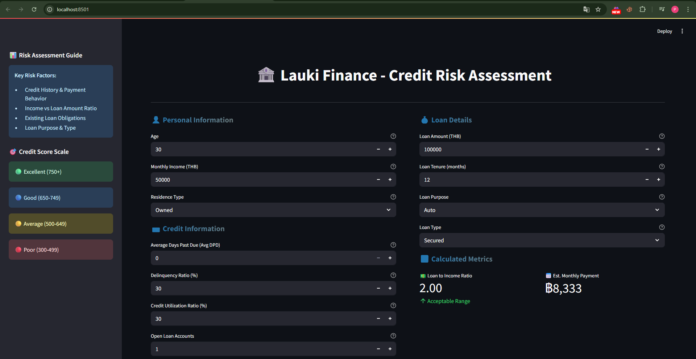
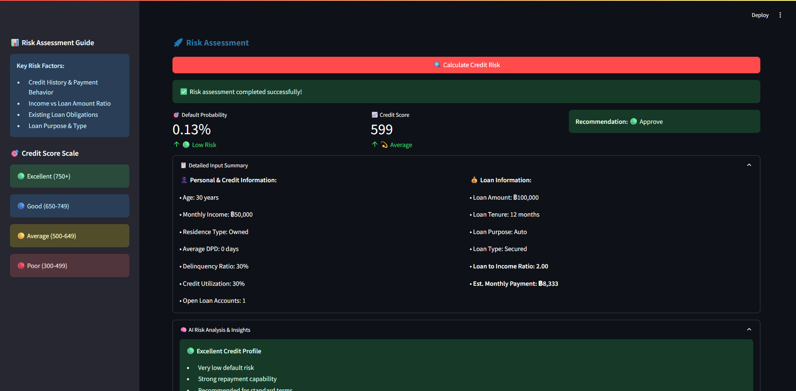

# 🏦 Lauki Finance - Credit Risk Assessment System

A comprehensive AI-powered credit risk assessment system built with Streamlit and machine learning to evaluate loan default probability and credit scores.

## 📋 Table of Contents
- [Overview](#overview)
- [Features](#features)
- [Screenshots](#screenshots)
- [Installation](#installation)
- [Usage](#usage)
- [File Structure](#file-structure)
- [Model Information](#model-information)
- [API Reference](#api-reference)
- [Contributing](#contributing)
- [License](#license)

## 🎯 Overview

The Lauki Finance Credit Risk Assessment System is a machine learning application designed to:
- Evaluate credit risk for loan applications
- Calculate default probability percentages
- Generate credit scores (300-850 scale)
- Provide credit ratings (Poor, Average, Good, Excellent)
- Offer loan approval recommendations

## ✨ Features

### 🔍 Risk Assessment
- **Default Probability Calculation**: ML-based probability estimation
- **Credit Score Generation**: 300-850 scale scoring system
- **Credit Rating**: Letter-based rating system (A+ to D)
- **Loan Recommendations**: Approve/Review/Decline suggestions

### 📊 Input Parameters
- **Personal Information**: Age, Monthly Income, Residence Type
- **Credit Information**: DPD, Delinquency Ratio, Credit Utilization, Open Accounts
- **Loan Details**: Amount, Tenure, Purpose, Type
- **Calculated Metrics**: Loan-to-Income Ratio, Monthly Payment

### 🎨 User Interface
- **Modern Design**: Gradient colors and professional styling
- **Responsive Layout**: Two-column layout with sidebar
- **Interactive Elements**: Real-time calculations and validations
- **Enhanced Visualization**: Color-coded risk levels and metrics

## 📸 Screenshots

### Main Interface

*Main application interface showing input forms for personal information, credit data, and loan details with modern gradient styling*

### Risk Assessment Results

*Risk assessment results display showing default probability, credit score, rating, and detailed analysis with color-coded recommendations*

## 🚀 Installation

### Prerequisites
```bash
Python 3.7+
pip package manager
```

### Required Packages
```bash
pip install streamlit pandas numpy scikit-learn joblib
```

### Setup Instructions
1. **Clone the repository**
```bash
git clone <repository-url>
cd ML-Credit-Risk-Model
```

2. **Install dependencies**
```bash
pip install -r requirements.txt
```

3. **Create required directories**
```bash
mkdir artifacts
```

4. **Run the application**
```bash
streamlit run main.py
```

## 💻 Usage

### Starting the Application
```bash
streamlit run main.py
```
The application will open in your default web browser at `http://localhost:8501`

### Input Fields Guide

#### 👤 Personal Information
- **Age**: Customer's age (18-100 years)
- **Monthly Income**: Income in Thai Baht (THB)
- **Residence Type**: Owned, Mortgage, or Rented

#### 💳 Credit Information
- **Average DPD**: Days past due on previous payments
- **Delinquency Ratio**: Percentage of accounts with delays (0-100%)
- **Credit Utilization**: Percentage of credit limit used (0-100%)
- **Open Loan Accounts**: Number of active loan accounts

#### 💰 Loan Details
- **Loan Amount**: Requested amount in THB
- **Loan Tenure**: Duration in months (1-360)
- **Loan Purpose**: Auto, Home, Personal, Education
- **Loan Type**: Secured or Unsecured

### Output Interpretation

#### Risk Levels
- 🟢 **Low Risk**: < 10% default probability
- 🟡 **Moderate Risk**: 10-20% default probability  
- 🔴 **High Risk**: > 20% default probability

#### Credit Score Ranges
- 🌟 **Excellent**: 750-850
- ⭐ **Good**: 650-749
- 💫 **Average**: 500-649
- ❌ **Poor**: 300-499

## 📁 File Structure

```
ML-Credit-Risk-Model/
│
├── main.py                     # Main Streamlit application
├── prediction_helper.py        # ML prediction functions
├── README.md                   # Project documentation
├── requirements.txt            # Python dependencies
│
├── artifacts/                  # Model artifacts directory
│   └── model_data.joblib      # Trained model and components
│
└── screenshots/               # Application screenshots
    ├── main_interface.png
    └── risk_results.png

```

## 🤖 Model Information

### Model Architecture
- **Algorithm**: Logistic Regression (or your specific model)
- **Features**: 24 input features including personal, credit, and loan data
- **Preprocessing**: StandardScaler for numerical features
- **Output**: Binary classification (Default/No Default)

### Feature Engineering
```python
# Key calculated features
loan_to_income_ratio = loan_amount / monthly_income
monthly_payment = loan_amount / loan_tenure
credit_utilization_ratio = used_credit / total_credit_limit
```

### Model Components (model_data.joblib)
- `model`: Trained classifier
- `scaler`: StandardScaler for preprocessing
- `features`: List of feature names
- `cols_to_scale`: Columns requiring scaling

## 📚 API Reference

### Main Functions

#### `predict_risk()`
Main prediction function that processes input and returns risk assessment.

```python
def predict_risk(age, income, loan_amount, loan_tenure,
                avg_dpd, delinquency_ratio, 
                credit_utilization_ratio, open_loan_accounts, 
                residence_type, loan_purpose, loan_type):
    """
    Predict credit risk for loan application
    
    Parameters:
    -----------
    age : int
        Customer's age (18-100)
    income : float
        Monthly income in THB
    loan_amount : float
        Requested loan amount in THB
    loan_tenure : int
        Loan duration in months
    avg_dpd : int
        Average days past due
    delinquency_ratio : float
        Delinquency ratio (0-1)
    credit_utilization_ratio : float
        Credit utilization ratio (0-1)
    open_loan_accounts : int
        Number of open loan accounts
    residence_type : str
        'Owned', 'Mortgage', or 'Rented'
    loan_purpose : str
        'Auto', 'Home', 'Personal', or 'Education'
    loan_type : str
        'Secured' or 'Unsecured'
    
    Returns:
    --------
    tuple
        (default_probability, credit_score, credit_rating)
    """
```

#### `preprocess_input()`
Preprocesses input data for model prediction.

```python
def preprocess_input(*args):
    """
    Convert input parameters to model-ready DataFrame
    
    Returns:
    --------
    pd.DataFrame
        Processed input data with all required features
    """
```

#### `calculate_credit_score()`
Calculates credit score from model probability.

```python
def calculate_credit_score(input_df, base_score=300, scale_length=300):
    """
    Calculate credit score from model prediction
    
    Parameters:
    -----------
    input_df : pd.DataFrame
        Preprocessed input data
    base_score : int
        Minimum credit score (default: 300)
    scale_length : int
        Score range (default: 300, making max score 600)
    
    Returns:
    --------
    tuple
        (default_probability_percent, credit_score, rating)
    """
```

#### `get_credit_rating()`
Converts credit score to letter rating.

```python
def get_credit_rating(credit_score):
    """
    Convert numeric credit score to letter rating
    
    Parameters:
    -----------
    credit_score : int
        Credit score (300-850)
    
    Returns:
    --------
    str
        Credit rating ('Poor', 'Average', 'Good', 'Excellent')
    """
```

### Streamlit Components

#### Page Configuration
```python
st.set_page_config(
    page_title="Lauki Finance - Credit Risk Assessment",
    page_icon="🏦",
    layout="wide",
    initial_sidebar_state="expanded"
)
```

#### Input Widgets
```python
# Number inputs
age = st.number_input("Age", min_value=18, max_value=100, value=30)
income = st.number_input("Monthly Income (THB)", min_value=0.0, value=50000.0)

# Select boxes
residence_type = st.selectbox("Residence Type", ["Owned", "Mortgage", "Rented"])
loan_purpose = st.selectbox("Loan Purpose", ["Auto", "Home", "Personal", "Education"])
```

#### Results Display
```python
# Metrics display
st.metric("🎯 Default Probability", f"{probability:.2f}%")
st.metric("📈 Credit Score", f"{credit_score}")

# Color-coded results
if probability < 10:
    st.success("🟢 Low Risk Customer")
elif probability < 20:
    st.warning("🟡 Moderate Risk Customer")
else:
    st.error("🔴 High Risk Customer")
```

## 🎨 Custom Styling

The application uses custom CSS for enhanced visual appeal:

```css
.main-header {
    font-size: 2.5rem;
    font-weight: bold;
    color: #1f77b4;
    text-align: center;
    text-shadow: 2px 2px 4px rgba(0,0,0,0.1);
}

.section-header {
    background: linear-gradient(90deg, #1f77b4, #ff7f0e);
    -webkit-background-clip: text;
    -webkit-text-fill-color: transparent;
    font-size: 1.3rem;
    font-weight: bold;
}
```

## 🚦 Error Handling

The system includes comprehensive error handling for:
- Missing model files (creates dummy model)
- Invalid input values (validation and constraints)
- Preprocessing errors (fallback calculations)
- Model prediction failures (default risk calculations)

## 🔧 Configuration

### Model Path Configuration
```python
MODEL_PATH = "artifacts/model_data.joblib"
```

### Default Values
```python
DEFAULT_VALUES = {
    'age': 30,
    'income': 50000.0,
    'loan_amount': 100000.0,
    'loan_tenure': 12,
    'avg_dpd': 0,
    'delinquency_ratio': 30,
    'credit_utilization_ratio': 30,
    'open_loan_accounts': 1
}
```

## 📊 Sample Usage

### Command Line Testing
```python
# Test the prediction function
from prediction_helper import predict_risk

probability, credit_score, rating = predict_risk(
    age=30,
    income=50000,
    loan_amount=100000,
    loan_tenure=12,
    avg_dpd=5,
    delinquency_ratio=0.1,
    credit_utilization_ratio=0.3,
    open_loan_accounts=2,
    residence_type='Owned',
    loan_purpose='Personal',
    loan_type='Secured'
)

print(f"Default Probability: {probability:.2f}%")
print(f"Credit Score: {credit_score}")
print(f"Credit Rating: {rating}")
```

### Web Interface Usage
1. Open the application in browser
2. Fill in customer information in the left column
3. Enter loan details in the right column
4. Review calculated metrics
5. Click "🔍 Calculate Credit Risk"
6. Analyze results and recommendations

## 🛠️ Troubleshooting

### Common Issues

#### Model File Not Found
```
FileNotFoundError: [Errno 2] No such file or directory: 'artifacts/model_data.joblib'
```
**Solution**: The system automatically creates a dummy model for testing. Replace with your trained model when available.

#### Import Errors
```
ModuleNotFoundError: No module named 'streamlit'
```
**Solution**: Install required packages using `pip install -r requirements.txt`

#### Port Already in Use
```
OSError: [Errno 98] Address already in use
```
**Solution**: Use a different port with `streamlit run main.py --server.port 8502`

## 🤝 Contributing

1. Fork the repository
2. Create a feature branch (`git checkout -b feature/AmazingFeature`)
3. Commit your changes (`git commit -m 'Add some AmazingFeature'`)  
4. Push to the branch (`git push origin feature/AmazingFeature`)
5. Open a Pull Request

## 📄 License

This project is licensed under the MIT License - see the LICENSE file for details.


## 🙏 Acknowledgments

- Machine Learning libraries: scikit-learn, pandas, numpy
- Web framework: Streamlit
- UI/UX inspiration from modern fintech applications
- Thai financial market requirements and regulations

---


## 🔄 Version History

- **v1.0.0** - Initial release with basic risk assessment
- **v1.1.0** - Enhanced UI and additional metrics
- **v1.2.0** - Improved error handling and model flexibility

---

**🏦 Lauki Finance - Empowering Smart Lending Decisions**